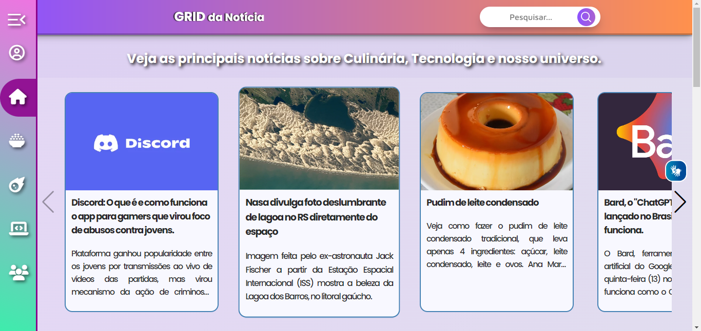
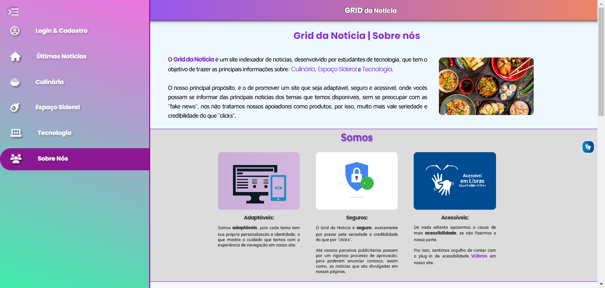
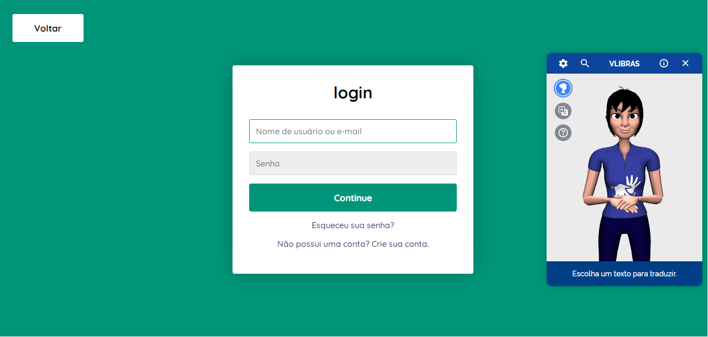

<h1 align='center'>Olá! Bem vid@ ao Grid <small>da Notícia</small>!</h1>

Este é um site desenvolvido por dois estudantes, o <a target="_blank" href='https://www.linkedin.com/in/mauricio-marques-costa-994b25210/'>Mauricio</a> e o <a target="_blank" href='https://www.linkedin.com/in/michael-paes-050817200/'>Michael</a> que tiveram o seu primeiro contato com a programação, durante um programa de capacitação à tecnologia com foco em front-end, oferecido por uma parceria entre <a href='https://pages.prozeducacao.com.br/proz-tecnologia'> PROZ, AMAZON, PORTAL TECH e META</a>. 🤝
 

 

 

Nós nunca havíamos programado antes, e já em nossa primeira experiência com a área de programação, fizemos o desenvolvimento de um site de notícias, e apresentamos ele como parte final do Projeto Integrador, onde, o principal objetivo, é mostrar na prática, os conhecimentos que aprendemos durante as aulas, repassando eles para um site, que no nosso caso, foi o Grid da Notícia, um site de notícias, apresentado no dia 24/08/2023. 😊

 

Veja algumas imagens de como ficou o site, que pode ser acessado através do link:

🔗 https://grid-da-noticia.vercel.app/index.html

 

 

 

 

O site está responsivo, então, pode ser acessado por telas menores, que funcionará com algumas adaptações que preparamos. 

Esse foi o nosso primeiro contato com a programação, e o desenvolvimento do site o resultado de nossos esforços. 😉	

 

<h1 align='center'>Site desenvolvido com ❤️ por</h1>

 

<a target="_blank" href='https://www.linkedin.com/in/mauricio-marques-costa-994b25210/'>Mauricio Marques</a>

<a target="_blank" href='https://www.linkedin.com/in/michael-paes-050817200/'>Michael Paes</a>

 

<h1 align='center'>Agradecimentos</h1>

 Deixamos aqui o nosso agradecimento à todos os participantes que chegaram ao final da jornada e a toda equipe da PROZ, por permitir essa oportunidade de estudos em tecnologia, um tema que parece ser complicado de se aprender, mas, nos ensinaram de uma simples, compreensível e muito prática, nos ajudando em todas as dificuldades que apareciam no caminho.

Muito obrigado equipe Proz!  😊 

 

<h1 align='center'>Sobre o Programa</h1>

 

O Portal Tech é um programa criado pela AWS e pela Meta, em duas fases, para abrir um portal de acesso ao conhecimento sobre algumas das tecnologias que mais crescem no mundo: a computação em nuvem, o metaverso e o marketing digital.

O objetivo do programa é apresentar essas tecnologias às pessoas não familiarizadas com o setor, formar pessoas que não teriam acesso
à educação em tecnologia e conectá-las com as demandas do mercado de trabalho, por meio de uma formação gratuita.

 

<h1 align='center'>Aprendizado</h1>

 

O programa teve duração de 4 meses, e durante esse tempo, tivemos a introdução sobre:

 

Lógica Imperativa ->  Compreender o que é a lógica. O que está por trás da condução do pensamento ordenado. O raciocínio lógico e a conexão com algoritmos. Interpretação computacional dos algoritmos. Tipos de dados. O que são variáveis, tipos e sintaxe. Operadores relacionais e lógicos. Estrutura condicional. Estrutura de repetição.  

 

Introdução a Programação ->  Programação de sistemas. Algoritmo estruturado e não-estruturado. Ambiente de desenvolvimento. Tipos básicos de variáveis. Tipos de operadores. Estruturas condicionais lógicas. Laços de repetição. Funções de códigos. Dados do usuário. Problemas no sistema. Tipos artificiais de dados. Acesso a tabelas e listas de arquivos de dados. 

 

HTML e CSS ->  Arrays. VSCode: Instalação; configuração inicial e abertura de projetos. Git. Github.​  O que é HTML. Principais tags: teoria e prática. Corpo de uma página. O que é CSS e sua aplicabilidade. Propriedades do CSS. Importação e manipulação de fontes.  

 

JavaScript 1 ->  História do JS. Ambientes de desenvolvimento. Variáveis em JS. Operadores em JS. Estruturas condicionais em JS. Loops em JS. Funções em JS. Conexão com HTML. Seletores DOM. InnerText e InnerHTML. Criando elementos no DOM.​ 

 

JavaScript 2 ->  Adicionar estilos com a propriedade .style. Manipular classes com a propriedade .classList. Função .addEventListener(). Eventos de mouse. Capturar informações do evento. Eventos de teclado. Funções preventDefault() e alert(). Eventos onFocus, onBlur, onChange e onSubmit.  
 

Banco de Dados 1 ->  Conceitos básicos de BD. Modelagem de banco de dados relacionais. SGBD. Linguagem SQL. Implementação de um banco de dados em SQL.   

 

Banco de Dados 2 ->  Junção entre tabelas. Chaves primárias e estrangeiras. Trigger. Function e Procedure. Integridade, Confiabilidade e Disponibilidade. Relação do backup com banco de dados e senhas fortes. Criptografia.  

 

<h1 align='center'>Aplicações Utilizadas</h1>
 

Durante o curso vimos a introdução e utilizamos as seguintes aplicações:

 

- [VisuAlg](https://visualg3.com.br/)

- [VSCode](https://code.visualstudio.com/)

- [Git](https://git-scm.com/)

- [GitHub](https://github.com/)

- [Colab](https://colab.research.google.com/)

- [HTML](https://developer.mozilla.org/pt-BR/docs/Web/HTML)

- [CSS](https://blog.betrybe.com/css/#1)

- [JavaScript](https://developer.mozilla.org/pt-BR/docs/Learn/JavaScript/First_steps/What_is_JavaScript)

- [SQL](https://aws.amazon.com/pt/what-is/sql/)

 

Arquivos Iniciais do site:

🔗 https://drive.google.com/drive/folders/1vFflf5ujFuCIDveo5O1MdXSpBlgL4wIi?usp=sharing
